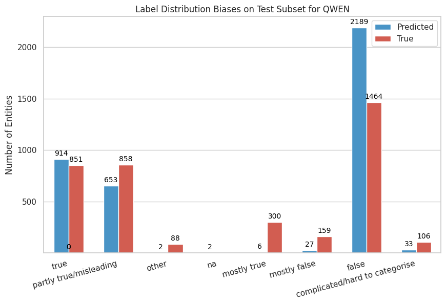
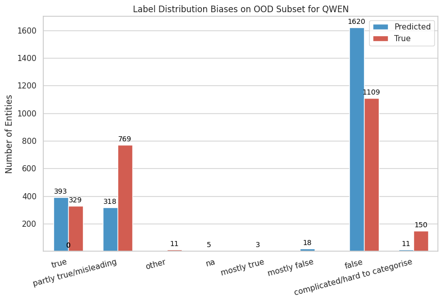
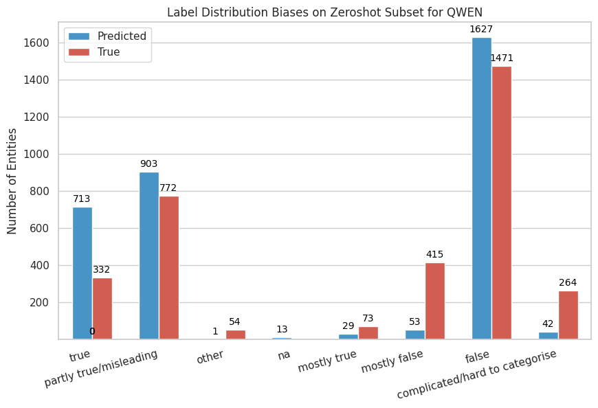

In this folder, we present label distribution biases on test, out-of-domain, and zero-shot subsets from the X-Fact dataset for the **LLaMA 3.1**, **Mistral**, **NeMo**, and **Qwen 2.5** models.

Here are the results for Qwen 2.5 model:

## Text Processing and Label Extraction Methodology

### Text Normalization Procedures

The text normalization process for model outputs consisted of several sequential steps to ensure consistent label extraction across different response formats. First, all model outputs were converted to lowercase to enable case-insensitive matching. Second, text following specific markers was extracted using a hierarchical approach, prioritizing text following `"label:"` markers, with text following `"assistant"` markers used as a fallback when primary markers were absent.

### Label Mapping Procedures

The label mapping system employed a hierarchical matching approach to handle variations in model outputs while maintaining consistency with the seven-category classification scheme. Seven labels were defined with associated variant forms:

* **complicated/hard to categorise**: matched variants including `"complicated"` and `"hard to categorise"`
* **partly true/misleading**: matched variants including `"partly true"` and `"misleading"`
* **mostly false**
* **mostly true**
* **false**
* **true**
* **other** (each matched their respective single variants)

The label extraction algorithm processed normalized text through sequential matching. For each label category, the algorithm checked for the presence of any associated variant in the processed text. Upon finding a match, the corresponding label was assigned and processing terminated. When no valid label variants were detected, the output was classified as *na* (not available), indicating instruction-following failure.
